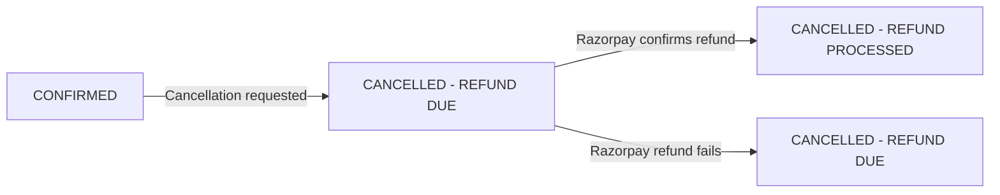

TktPlz supports ticket cancellations and refunds for events where the organizer has enabled this option. Whether a refund is available depends on an event-level setting controlled by the organizer, not by TktPlz globally. When a cancellation is processed, the refund is initiated through Razorpay and typically credited back within 5–7 business days.

## When refunds are available

Refunds are only possible when the event has both of the following flags set by the organizer:

| Field | Description |
|---|---|
| `isRefundable` | When `true`, the event allows refunds for cancelled tickets |
| `isTicketsCancelleable` | When `true`, attendees are permitted to cancel their own tickets |

If the organizer did not enable cancellations, the **Cancel Ticket** button does not appear on the Order Details page.

<Warning>
  Even when an event allows cancellations, you can only cancel a ticket that is in `CONFIRMED` status and at least 12 hours before the event starts. Tickets closer to the event start time cannot be self-cancelled.
</Warning>

---

## How to request a refund

<Steps>
  <Step title="Go to Your Orders">
    Navigate to **Your Orders** from the main menu. Each order card shows the event name, booking ID, ticket count, status badge, and total amount paid. Orders that have already been cancelled are shown with a strikethrough and a "Refund Initiated" or "Refund Processed" label.
  </Step>
  <Step title="Open Order Details">
    Click on the order you want to cancel. Cancelled tickets cannot be opened — only `CONFIRMED` orders show the full detail page.

    The Order Details page shows:
    - Event details (date, time, venue or online link)
    - Seat or zone assignments
    - Booking information (number of tickets, amount paid, payment method)
    - QR code entry pass
    - Payment ID and Order ID
  </Step>
  <Step title="Cancel your ticket">
    If the event allows cancellations and the event is more than 12 hours away, a **Cancel Ticket** button appears. Clicking it opens a confirmation modal.

    The modal reminds you that:
    - Refunds are processed within 5–7 business days
    - Cancellation charges may apply as per the organizer's terms

    Confirm the cancellation to proceed.
  </Step>
  <Step title="Refund initiated">
    TktPlz calls `POST /api/payment/refund` with your `orderId` and the full `totalAmount`. If successful, your ticket status changes to `CANCELLED - REFUND DUE` and you receive a confirmation email with the refund ID and estimated processing time.
  </Step>
  <Step title="Refund completed">
    When Razorpay confirms the refund, your ticket status is updated to `CANCELLED - REFUND PROCESSED` and a second email is sent confirming the refund has been credited. The refund record in TktPlz is updated to `status: "completed"`.
  </Step>
</Steps>

---

## POST /api/payment/refund

Initiates a ticket cancellation and refund. This endpoint is called by the Order Details page when you confirm cancellation.

**Request body**

<ParamField body="orderId" type="string" required>
  The Razorpay order ID associated with the ticket to be cancelled. Shown on the Order Details page as "Order ID".
</ParamField>

<ParamField body="refundAmount" type="number">
  Amount to refund in INR. If omitted, defaults to the full `totalAmount` from the original booking. The refund amount cannot exceed the original ticket amount.
</ParamField>

**Example request**

```json
{
  "orderId": "order_PQR456STU789",
  "refundAmount": 1300
}
```

**Example response (200)**

```json
{
  "success": true,
  "message": "Refund initiated successfully",
  "data": {
    "refundId": "rfnd_ABCDEF123456",
    "orderId": "order_PQR456STU789",
    "amount": 1300,
    "status": "processing",
    "estimatedProcessingTime": "5-7 business days"
  }
}
```

**Response fields**

<ResponseField name="success" type="boolean" required>
  `true` when the refund was successfully initiated with Razorpay.
</ResponseField>

<ResponseField name="data" type="object">
  <Expandable title="properties">
    <ResponseField name="refundId" type="string">
      Razorpay refund ID (e.g. `rfnd_ABCDEF123456`). Use this to track the refund.
    </ResponseField>
    <ResponseField name="orderId" type="string">
      The order ID the refund is associated with.
    </ResponseField>
    <ResponseField name="amount" type="number">
      Amount being refunded in INR.
    </ResponseField>
    <ResponseField name="status" type="string">
      Initial refund status. Always `"processing"` on a successful initiation.
    </ResponseField>
    <ResponseField name="estimatedProcessingTime" type="string">
      Human-readable estimate. Currently `"5-7 business days"`.
    </ResponseField>
  </Expandable>
</ResponseField>

**Error responses**

| Status | Error | Meaning |
|---|---|---|
| `400` | `"Order ID is required"` | `orderId` was not provided |
| `404` | `"Ticket not found"` | No ticket exists for the given `orderId` |
| `400` | `"Only confirmed tickets can be cancelled"` | Ticket is not in `CONFIRMED` status |
| `400` | `"Refund already processed or in progress"` | A non-failed refund already exists for this order |
| `400` | `"Refund amount cannot exceed ticket amount"` | `refundAmount` is greater than the original charge |
| `500` | `"Refund processing failed"` | Razorpay returned an error; the refund record is saved as `failed` |

---

## Cancellation policy

The organizer sets the cancellation policy when creating the event. Two separate flags control behavior:

- **`isRefundable`** — whether a monetary refund is issued on cancellation
- **`isTicketsCancelleable`** — whether attendees can initiate cancellations themselves

An event can be cancellable without being refundable (the ticket is voided but no money is returned), though in practice TktPlz always attempts a Razorpay refund for cancellable paid events.

<Tip>
  If you are unsure whether an event you booked supports cancellations, check the Order Details page. If the **Cancel Ticket** button is not visible, the organizer has not enabled self-service cancellations.
</Tip>

---

## Ticket status lifecycle

Your ticket's `status` field tracks the state of your booking through the full cancellation and refund process.



| Status | Shown in Your Orders as | Meaning |
|---|---|---|
| `CONFIRMED` | Green — Confirmed | Booking is active; ticket is valid |
| `CANCELLED - REFUND DUE` | Orange — Refund Initiated | Cancellation processed; refund sent to Razorpay |
| `CANCELLED - REFUND PROCESSED` | Red — Refund Processed | Razorpay has completed the refund |
| `CANCELLED` | Red — Cancelled | Ticket cancelled without a refund |

<Note>
  Once a ticket moves to any `CANCELLED` status, the Order Details page becomes inaccessible for that order. You can still see the order summary card in Your Orders.
</Note>

---

## Refund schema

TktPlz records every refund in the `refunds` table. The following fields are tracked:

| Field | Type | Description |
|---|---|---|
| `id` | int | Auto-incremented refund record ID |
| `orderId` | varchar | Razorpay order ID the refund belongs to |
| `amount` | decimal | Amount refunded in INR |
| `reason` | varchar | Reason string (e.g. `"User cancellation"`) |
| `status` | varchar | Current refund status: `pending`, `processing`, `completed`, or `failed` |
| `refund_id` | varchar | Razorpay refund ID (e.g. `rfnd_...`) |
| `refundedAt` | timestamp | When the refund was confirmed as completed |
| `createdAt` | timestamp | When the refund record was first created |
| `updatedAt` | timestamp | Last time the record was modified |

### Refund status values

<AccordionGroup>
  <Accordion title="processing">
    The refund request was accepted by Razorpay and is in transit. Your ticket is already marked `CANCELLED - REFUND DUE`. No action is needed from you.
  </Accordion>
  <Accordion title="completed">
    Razorpay has confirmed the refund has been credited to your original payment method. Your ticket status updates to `CANCELLED - REFUND PROCESSED` and a confirmation email is sent.
  </Accordion>
  <Accordion title="failed">
    The refund was rejected by Razorpay (for example, if the payment method was closed). TktPlz records the failure. Contact support if your refund remains in `failed` status.
  </Accordion>
</AccordionGroup>

---

## Email notifications

TktPlz sends two emails during the refund process:

<CardGroup cols={2}>
  <Card title="Refund initiated email" icon="paper-plane">
    Sent when your cancellation is confirmed and the refund is submitted to Razorpay. Includes the event name, refund amount, Razorpay refund ID, and estimated processing time of 5–7 business days.
  </Card>
  <Card title="Refund completed email" icon="circle-check">
    Sent when Razorpay confirms the refund has been processed. Includes the event name, refund amount, and refund ID. This email confirms the money has been returned to your original payment method.
  </Card>
</CardGroup>
